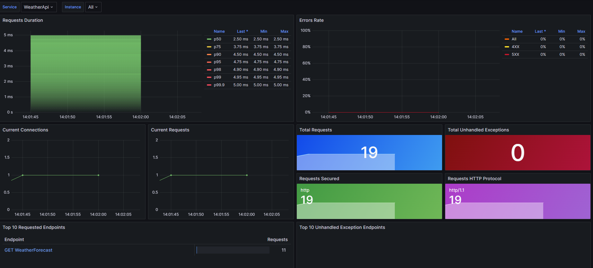

# ObservaBLT avec Grafana
## Description
Ce dépôt GitHub fournit une configuration Docker Compose pour mettre en place un environnement d'observabilité avec les composants suivants:

- Grafana
- Prometheus
- Tempo
- Loki
- OpenTelemetry

Une application d'exemple .NET Core (WeatherApi) est incluse, et ce README contient un guide étape par étape sur la manière d'améliorer son observabilité en utilisant OpenTelemetry.


## Installation
Pour exécuter l'environnement de surveillance et WeatherApi, assurez-vous d'avoir Docker et Docker Compose installés. Clonez le dépôt et utilisez la commande suivante, pour lancer tous les services nécessaires.

```bash
docker-compose up -d
```

Pour arreter les services: 

```bash
docker compose down
```

## Utilisation
Pour accèder à Grafana: http://localhost:3000 
Pour l'accès à Prometheus: http://localhost:9090
Pour l'accès aux metrics exposés par l'OpenTelemetry Collector: http://localhost:8889/metrics

## Ajouter de l'Observabilité à une application

### Étape 1 : Configurer OpenTelemetry

Ajoutez les packages NuGet `OpenTelemetry.Instrumentation.AspNetCore` permettant de collecter les données d'ASP.NET Core et Kestrel ainsi que `OpenTelemetry.Exporter.OpenTelemetryProtocol` permettant d'exporter les données en utilisant le protocole OTLP
```bash
dotnet add package OpenTelemetry.Instrumentation.AspNetCore
dotnet add package OpenTelemetry.Exporter.OpenTelemetryProtocol
```

Dans le projet de l'application, créez une méthode d'extension pour configurer OpenTelemetry. 

```csharp
using Microsoft.AspNetCore.Builder;
using Microsoft.Extensions.DependencyInjection;
using Microsoft.Extensions.Hosting;
using OpenTelemetry.Instrumentation.AspNetCore;

public static class OpenTelemetryExtensions
{
    public static WebApplicationBuilder ConfigureOpenTelemetry(this WebApplicationBuilder builder)
    {
        var useOtlpExporter = !string.IsNullOrWhiteSpace(builder.Configuration["OTEL_EXPORTER_OTLP_ENDPOINT"]);

        return builder;
    }
}
```

Ajouter une classe `Instrumentation` comme celle-ci : 

```csharp
public static class Instrumentation
{
    /// <summary>
    /// The assembly name.
    /// </summary>
    public static readonly AssemblyName AssemblyName = typeof(Instrumentation).Assembly.GetName();

    /// <summary>
    /// The activity source name.
    /// </summary>
    public static readonly string ActivitySourceName = AssemblyName.Name!;

    /// <summary>
    /// The version.
    /// </summary>
    public static readonly Version Version = AssemblyName.Version!;

    /// <summary>
    /// The activity source.
    /// </summary>
    public static readonly ActivitySource ActivitySource = new(ActivitySourceName, Version.ToString());
}
```

Pour plus d'information [https://learn.microsoft.com/fr-fr/dotnet/core/diagnostics/distributed-tracing-instrumentation-walkthroughs#add-basic-instrumentation](learn microsoft)

### Étape 2 : Configuration des Logs

Ajoutez le code nécessaire pour la configuration des logs dans la méthode ConfigureOpenTelemetry. Mettez à jour les options du logger et incluez OpenTelemetry.

```csharp
builder.Logging.AddOpenTelemetry(o =>
{
    o.IncludeFormattedMessage = true;
    o.IncludeScopes = true;
});
```

Et ajouter le code afin de rajouter l'exporter OpenTelemetryProtocol

```csharp
// ... Code existant
if (useOtlpExporter)
{
    builder.Services.Configure<OpenTelemetryLoggerOptions>(logging => logging.AddOtlpExporter());
}

return builder;
```

### Étape 3 : Configuration des Métriques

Ajoutez l'instrumentation pour ASP.NET Core, le runtime et le client HTTP.
```csharp
builder.Services.AddOpenTelemetry()
    .ConfigureResource(resource => resource.AddService(serviceName: builder.Environment.ApplicationName))
    .WithMetrics(metrics =>
    {
        metrics.AddAspNetCoreInstrumentation()
               .AddRuntimeInstrumentation()
               .AddHttpClientInstrumentation();
    });

```

Modifier le code afin de rajouter l'exporter OpenTelemetryProtocol
```csharp
// ... Code existant
if (useOtlpExporter)
{
    builder.Services.Configure<OpenTelemetryLoggerOptions>(logging => logging.AddOtlpExporter());
    builder.Services.ConfigureOpenTelemetryMeterProvider(metrics => metrics.AddOtlpExporter());
}
return builder;
```

### Étape 4 : Configuration de la Trace

Configurez les paramètres les traces distribués dans la méthode `ConfigureOpenTelemetry`. 

Et ajoutez l'instrumentation pour ASP.NET Core et le client HTTP.

```csharp
// ... Code existant
tracing.AddAspNetCoreInstrumentation()
       .AddSource(Instrumentation.ActivitySourceName)
       .AddHttpClientInstrumentation();
// ... Code existant       
```

Modifier le code pour rajouter l'exporter OpenTelemetryProtocol
```csharp
// ... Code existant
if (useOtlpExporter)
{
    // ... Code existant
    builder.Services.ConfigureOpenTelemetryTracerProvider(tracing => tracing.AddOtlpExporter());
}
return builder;
```


# Screenshot
## Metrics - ASP.NET Core Grafana Dashboard




> [!IMPORTANT]
> **Les dashboards présentés sont inspiré des dashboards dont vous retrouverez le source code ici:**
> **https://aka.ms/dotnet/grafana-source.**

